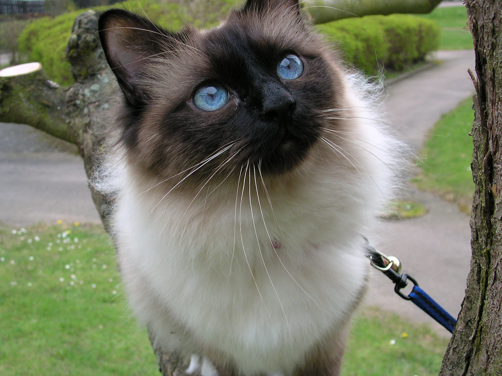

# Eyes
Both pupils follow around the user's cursor.
### Details
Translates eyeballs around from mouse event relative to the window's innerwidth and innerheight.
### Potential Improvements
It would be interesting to have the eyes shift as if in a head turning movement once the mouse event has reached a certain range.
### How to Run
Install dependencies from the [repository](https://github.com/TaylorCharlesHall/Eyes) into the same directory. Drag and drop index file into any browser. You can also run it by clicking [here](https://taylorcharleshall.github.io/eyesrun).

[Home](https://taylorcharleshall.github.io)
